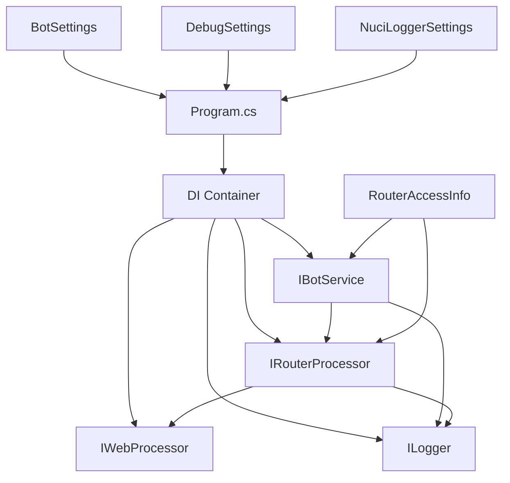
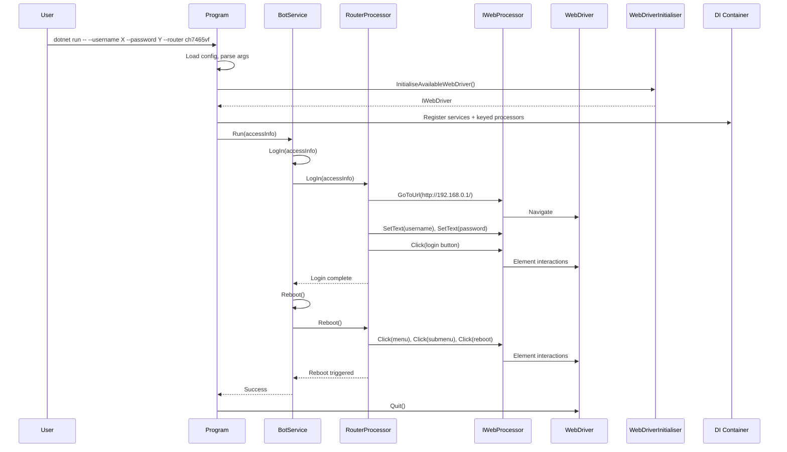

# Architecture

## Overview

Wireless Router Rebooter is a .NET console application that automates router reboot via web interface. It uses Selenium WebDriver for browser automation and a plugin architecture for router-specific logic.

## High-Level Structure

```
WirelessRouterRebooter/
├── Program.cs                    # Entry point, DI setup, argument parsing
├── Configuration/                # Settings classes (BotSettings, DebugSettings)
├── Logging/                      # Custom log keys and operations
├── Service/
│   ├── IBotService.cs           # Main service interface
│   ├── BotService.cs            # Orchestrates login + reboot
│   ├── Models/
│   │   └── RouterAccessInfo.cs  # Credentials + IP
│   └── Processors/
│       ├── IRouterProcessor.cs  # Router plugin interface
│       ├── RouterProcessor.cs   # Base class with common fields
│       ├── CompalCH7465VF.cs    # Compal CH7465VF implementation
│       ├── TpLinkMR105Processor.cs  # TP-Link MR105 implementation
│       └── ZteF660.cs           # ZTE F660 implementation
```

## Component Diagram



## Data Flow

1. **Startup** (`Program.Main`)
   - Load `appsettings.json` into `BotSettings`, `DebugSettings`, `NuciLoggerSettings`
   - Parse CLI arguments → `RouterAccessInfo` + router key
   - Initialize WebDriver via `WebDriverInitialiser`
   - Build DI container with keyed `IRouterProcessor` registrations

2. **Execution** (`BotService.Run`)
   - Resolve keyed `IRouterProcessor` for selected router
   - Call `LogIn(accessInfo)` → navigate, fill credentials, submit
   - Call `Reboot()` → navigate to reboot page, confirm
   - Log each step with structured `LogInfo` keys

3. **Shutdown**
   - `webDriver.Quit()` in `finally` block
   - Optional crash screenshot on exception

## Key Abstractions

| Interface | Purpose | Implementations |
|-----------|---------|-----------------|
| `IRouterProcessor` | Router-specific login/reboot logic | `CompalCH7465VF`, `TpLinkMR105Processor`, `ZteF660` |
| `IWebProcessor` | Browser automation wrapper | `SeleniumWebProcessor` (NuciWeb) |
| `IBotService` | High-level workflow orchestration | `BotService` |
| `ILogger` | Structured logging | `NuciLogger` |

## Router Processor Pattern

Each router implements `IRouterProcessor` with:
- `BrandName`, `ModelName`, `IpAddress` (default IP)
- `LogIn(RouterAccessInfo)` - navigate to login, fill form, submit
- `Reboot()` - navigate to reboot page, trigger reboot

Base class `RouterProcessor` handles IP resolution (CLI override vs default).

## Configuration

| Section | Class | Purpose |
|---------|-------|---------|
| `botSettings` | `BotSettings` | `PageLoadTimeout` (reserved) |
| `debugSettings` | `DebugSettings` | `IsDebugMode`, `CrashScreenshotFileName` |
| `nuciLoggerSettings` | `NuciLoggerSettings` | Log file path, level, file output toggle |

## Dependencies

- **NuciWeb.Automation.Selenium** - WebDriver abstraction
- **NuciLog** - Structured logging with operations/keys
- **NuciCLI.Arguments** - CLI argument parsing
- **Microsoft.Extensions.\*** - DI, configuration

## Extensibility

To add a new router:

1. Create a new class in `Service/Processors/` implementing `IRouterProcessor`
2. Inherit from `RouterProcessor` base class
3. Implement `LogIn(RouterAccessInfo)` and `Reboot()` methods
4. Register in `Program.cs` with a unique keyed singleton registration
5. Add the key to `ParseDeviceArgument` validation

See [docs/extending.md](docs/extending.md) for detailed steps.

## Sequence Diagram: Router Reboot Flow



## Error Handling Strategy

| Layer | Approach |
|-------|----------|
| CLI Parsing | `ArgumentException` for invalid router key |
| Configuration | Optional `appsettings.json`; defaults used if missing |
| WebDriver Init | Exception propagates; logged as Fatal |
| Login/Reboot | Try/catch in `BotService`; logs Error with context; rethrows |
| Unhandled | `Program.Run` catches all; logs Fatal; saves crash screenshot if enabled |
| Shutdown | `webDriver.Quit()` in `finally` block always executes |

## Logging Context Keys

All log entries include structured context via `MyLogInfoKey`:

| Key | Present In |
|-----|------------|
| `IpAddress` | LogIn (start/success/failure), Reboot (start/success/failure) |
| `BrandName` | LogIn (start/success/failure), Reboot (start/success/failure) |
| `ModelName` | LogIn (start/success/failure), Reboot (start/success/failure) |
| `Username` | LogIn (start/success/failure) |

## Thread Safety

- Application is single-threaded (console app)
- `IWebDriver` singleton shared across processor methods
- `IWebProcessor` transient but stateless wrapper
- `RouterAccessInfo` singleton (immutable after construction)
- No concurrent access concerns

## Deployment Considerations

- **Headless mode** (default): Runs in CI/CD, servers without display
- **Debug mode** (`IsDebugMode=true`): Visible browser for selector development
- **Crash screenshots**: Enabled via `CrashScreenshotFileName`; saved to log directory
- **Log file**: Configured via `nuciLoggerSettings.logFilePath`; rotation not implemented
- **Network**: Requires HTTP access to router admin panel (no HTTPS support currently)
1. Create `NewRouterProcessor : RouterProcessor` in `Service/Processors`
2. Implement `LogIn` and `Reboot` using `IWebProcessor` selectors
3. Register in `Program.cs`: `.AddKeyedSingleton<IRouterProcessor, NewRouterProcessor>("key")`
4. Add key to `ParseDeviceArgument` validation

## Error Handling

- Exceptions in `LogIn`/`Reboot` are logged with `OperationStatus.Failure` then rethrown
- `AggregateException` inner exceptions logged individually
- Crash screenshot saved when `DebugSettings.IsCrashScreenshotEnabled`
- WebDriver always quit in `finally`